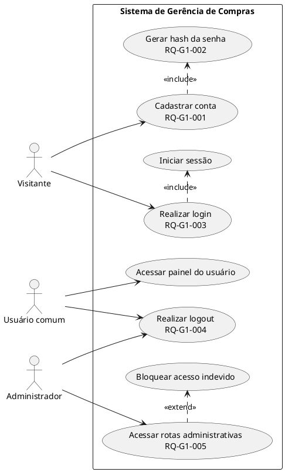
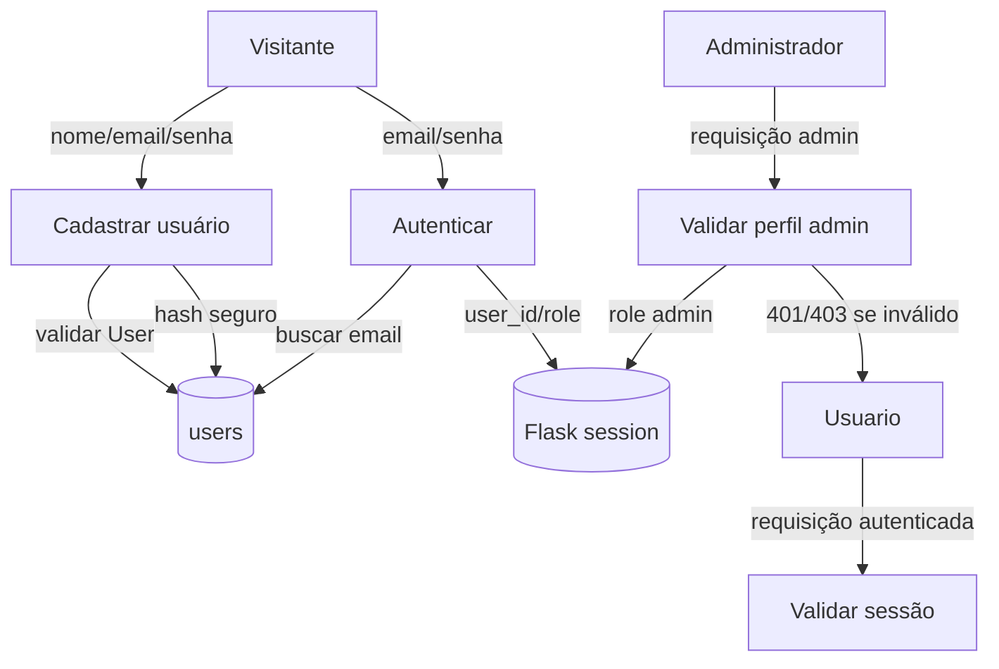
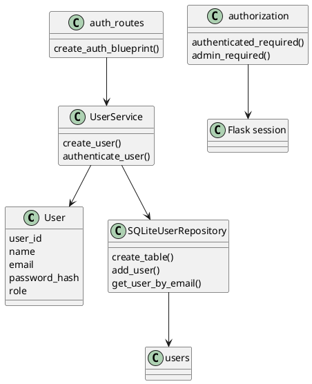
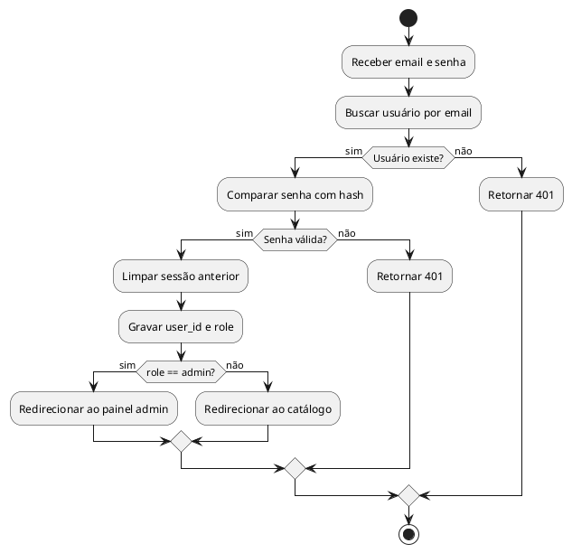

# Grupo 1 — Autenticação, usuários, sessão e perfis

## A. Integrantes responsáveis

- Gabriel Balder.
- Anabel Mendes.

## B. Responsabilidade do grupo

Este grupo representa a autenticação básica do sistema: cadastro de usuário, login, logout, criação e limpeza de sessão Flask, diferenciação entre usuário comum e administrador, validação de credenciais, senha com hash e controle de acesso por perfil.

## C. Arquivos de código relacionados

| Tipo | Arquivo | Função |
|---|---|---|
| Domínio | `app/domain/user.py` | Entidade `User` e validação de nome, e-mail, hash e papel. |
| Domínio | `app/domain/exceptions.py` | Exceções `InvalidUserError`, `DuplicateEmailError`, `InvalidCredentialsError`. |
| Aplicação | `app/application/user_service.py` | Cadastro com hash, autenticação com verificação de senha. |
| Infraestrutura | `app/infrastructure/user_repository.py` | Criação da tabela `users`, inserção e busca por e-mail. |
| Web JSON | `app/web/auth_routes.py` | Rotas `/auth/register`, `/auth/login`, `/auth/logout`. |
| Web autorização | `app/web/authorization.py` | Decorators `authenticated_required` e `admin_required`. |
| Web HTML | `app/web/html_routes.py` | Páginas `/login`, `/register`, `/logout`, `/dashboard`. |
| Templates | `login.html`, `register.html`, `base.html`, `user_dashboard.html` | Interface de login, cadastro, navegação por perfil e painel do usuário. |
| Testes | `tests/unit/test_user.py` | Testes da entidade `User`. |
| Testes | `tests/unit/test_user_service.py` | Testes de cadastro, hash, admin e e-mail duplicado. |
| Testes | `tests/integration/test_user_repository.py` | Testes SQLite da tabela `users`. |
| Testes | `tests/integration/test_auth_routes.py` | Testes JSON de registro, login e logout. |
| Testes | `tests/integration/test_html_routes.py`, `test_mvp_html_routes.py` | Testes HTML de login, cadastro, logout e navegação por perfil. |

## D. Estórias e requisitos atendidos

| RQ | Estória | Descrição | Critério de aceitação | Arquivos | Rotas | Testes | Status |
|---|---|---|---|---|---|---|---|
| RQ-G1-001 | US01 | Cadastrar usuário comum com nome, e-mail e senha. | Usuário válido retorna 201 na API ou redireciona no HTML; e-mail inválido/vazio é rejeitado. | `user.py`, `user_service.py`, `user_repository.py`, `auth_routes.py`, `html_routes.py` | `POST /auth/register`, `GET/POST /register` | `test_user.py`, `test_user_service.py`, `test_user_repository.py`, `test_auth_routes.py`, `test_mvp_html_routes.py` | Implementado |
| RQ-G1-002 | US01 | Armazenar senha protegida por hash. | Senha em texto puro não aparece no retorno nem no banco. | `user_service.py`, `user_repository.py` | `POST /auth/register`, `GET/POST /register` | `test_user_service.py`, `test_user_repository.py` | Implementado |
| RQ-G1-003 | US01 | Autenticar usuário por e-mail e senha. | Login válido grava `user_id` e `role` na sessão; login inválido retorna 401. | `user_service.py`, `auth_routes.py`, `html_routes.py` | `POST /auth/login`, `GET/POST /login` | `test_auth_routes.py`, `test_html_routes.py` | Implementado |
| RQ-G1-004 | US01 | Encerrar sessão. | Logout remove `user_id` e `role` da sessão. | `auth_routes.py`, `html_routes.py` | `POST /auth/logout`, `POST /logout` | `test_auth_routes.py`, `test_html_routes.py` | Implementado |
| RQ-G1-005 | RNF02 | Restringir rotas administrativas a administradores. | Visitante recebe 401; usuário comum recebe 403; admin acessa. | `authorization.py`, `routes.py`, `store_routes.py`, `admin_metrics_routes.py`, `html_routes.py` | Rotas `POST/PUT/DELETE/PATCH` administrativas | `test_product_routes.py`, `test_admin_metrics_routes.py`, `test_html_routes.py` | Implementado |
| RQ-G1-006 | US01/WEB | Exibir login administrativo de demonstração. | Tela de login mostra acesso admin e redireciona admin para painel. | `login.html`, `html_routes.py` | `GET/POST /login` | `test_html_routes.py` | Implementado |

## E. Descrição textual para Diagrama de Casos de Uso

Fronteira do sistema: aplicação web Flask de gerência de compras.  
Atores: visitante, usuário comum, administrador.

Casos de uso:

- Cadastrar conta: visitante informa nome, e-mail e senha. Inclui validar usuário e gerar hash.
- Realizar login: visitante informa e-mail e senha. Inclui verificar hash e iniciar sessão.
- Realizar logout: usuário autenticado encerra sessão.
- Acessar painel do usuário: requer sessão autenticada.
- Acessar funções administrativas: requer sessão autenticada com `role=admin`.
- Bloquear acesso indevido: extensão das rotas protegidas quando não autenticado ou sem perfil admin.

Pré-condições: banco `users` criado; Flask com `SECRET_KEY`; repositório e serviço de usuários inicializados.  
Pós-condições: sessão criada ou removida; usuários persistidos; acessos indevidos retornam 401/403.  
Regras de negócio: e-mail deve ser único; senha não é salva em texto puro; papel aceito é `user` ou `admin`; autorização fica na camada web.

## F. Fichas de Caso de Uso

### UC-G1-001 — Cadastrar conta

- Atores: visitante.
- Objetivo: criar conta de usuário comum.
- Requisitos: RQ-G1-001, RQ-G1-002.
- Pré-condições: tabela `users` existente.
- Pós-condições: usuário persistido com `role=user` e senha com hash.
- Fluxo principal:
  1. Visitante envia nome, e-mail e senha.
  2. Sistema valida nome, e-mail e senha.
  3. Sistema verifica duplicidade de e-mail.
  4. Sistema gera `password_hash`.
  5. Sistema persiste usuário.
  6. API retorna JSON 201 ou HTML inicia sessão e redireciona.
- Alternativos: e-mail duplicado retorna 409; dados inválidos retornam 400.
- Entrada: `name`, `email`, `password`.
- Saída: usuário sem `password_hash` exposto.
- Classes/rotas: `User`, `UserService.create_user`, `SQLiteUserRepository.add_user`, `/auth/register`, `/register`.

### UC-G1-002 — Realizar login

- Atores: visitante, administrador, usuário comum.
- Objetivo: autenticar credenciais e criar sessão.
- Requisitos: RQ-G1-003, RQ-G1-006.
- Pré-condições: usuário cadastrado.
- Pós-condições: sessão contém `user_id` e `role`.
- Fluxo principal:
  1. Ator informa e-mail e senha.
  2. Sistema busca usuário por e-mail.
  3. Sistema compara senha com hash.
  4. Sistema limpa sessão anterior.
  5. Sistema grava `user_id` e `role`.
  6. Admin é redirecionado para `/admin/dashboard`; usuário comum para catálogo.
- Exceções: credenciais inválidas retornam 401.
- Entrada: `email`, `password`.
- Saída: sessão autenticada.
- Classes/rotas: `UserService.authenticate_user`, `/auth/login`, `/login`.

### UC-G1-003 — Realizar logout

- Atores: usuário comum, administrador.
- Objetivo: encerrar sessão.
- Requisitos: RQ-G1-004.
- Pré-condições: sessão pode existir.
- Pós-condições: sessão limpa.
- Fluxo principal: ator aciona logout; sistema executa `session.clear()`.
- Saída: HTTP 204 na API ou redirecionamento para login no HTML.
- Classes/rotas: `/auth/logout`, `/logout`.

### UC-G1-004 — Validar autorização administrativa

- Atores: administrador, usuário comum, visitante.
- Objetivo: proteger operações administrativas.
- Requisitos: RQ-G1-005.
- Pré-condições: rota decorada com `admin_required`.
- Pós-condições: admin prossegue; visitante recebe 401; usuário comum recebe 403.
- Classes/rotas: `admin_required`, rotas de produtos, lojas e métricas.

## G. Descrição textual para Diagrama de Fluxo de Dados

Entidades externas: visitante, usuário comum, administrador.  
Processos: cadastrar usuário, autenticar credenciais, gerenciar sessão, validar autorização.  
Depósito de dados: `users`, sessão Flask.  
Entradas: nome, e-mail, senha, cookies de sessão.  
Saídas: JSON de usuário, códigos HTTP, redirecionamentos, sessão.

Nível 0: atores interagem com a aplicação Flask; a aplicação consulta/persiste usuários e controla sessão.

Nível 1:

## H. Descrição textual para Diagrama de Classes

Classes e componentes:

- `User`: `user_id`, `name`, `email`, `password_hash`, `role`; valida e normaliza atributos.
- `UserService`: cria usuário, gera hash, autentica com `check_password_hash`.
- `SQLiteUserRepository`: cria tabela, adiciona usuário, busca por e-mail.
- `auth_routes`: expõe API JSON.
- `html_routes`: expõe páginas de login/cadastro/logout.
- `authorization`: decorators de sessão e perfil.

## I. Descrição textual para Diagrama de Atividades

Fluxo principal de login:

## J. Assertivas de entrada, saída e corretude das funções

| Função | Arquivo | Propósito | Entrada | Saída | Invariante/corretude | Efeitos/erros | Requisitos | Testes |
|---|---|---|---|---|---|---|---|---|
| `User.__init__` | `domain/user.py` | Criar usuário válido. | nome/e-mail/hash/role válidos. | objeto `User`. | Só aceita `role` em `user/admin` e e-mail com formato mínimo. | `InvalidUserError`. | RQ-G1-001 | `test_user.py` |
| `User._validate_email` | `domain/user.py` | Normalizar e validar e-mail. | string não vazia com `@`. | e-mail normalizado. | E-mail é armazenado em minúsculas. | `InvalidUserError`. | RQ-G1-001 | `test_user.py` |
| `UserService.create_user` | `application/user_service.py` | Criar usuário com hash. | nome, e-mail, senha, role. | `User` persistido. | Nunca salva senha em texto puro. | `DuplicateEmailError`, `InvalidUserError`. | RQ-G1-001/002 | `test_user_service.py` |
| `UserService.authenticate_user` | `application/user_service.py` | Validar login. | e-mail e senha. | `User` autenticado. | Só retorna se hash confere. | `InvalidCredentialsError`. | RQ-G1-003 | `test_auth_routes.py` |
| `UserService._validate_password` | `application/user_service.py` | Validar senha antes do hash. | senha string. | senha aceita. | Não permite senha vazia. | `InvalidUserError`. | RQ-G1-002 | `test_user_service.py` |
| `SQLiteUserRepository.create_table` | `infrastructure/user_repository.py` | Criar tabela `users`. | conexão aberta. | tabela existente. | `email` é único; `role` tem `CHECK`. | commit. | RQ-G1-001 | `test_user_repository.py` |
| `SQLiteUserRepository.add_user` | `infrastructure/user_repository.py` | Persistir usuário. | `User` válido. | `user_id` preenchido. | Duplicidade vira exceção de domínio. | escrita SQLite. | RQ-G1-001/002 | `test_user_repository.py` |
| `SQLiteUserRepository.get_user_by_email` | `infrastructure/user_repository.py` | Buscar usuário. | e-mail. | `User` ou `None`. | Não expõe senha em resposta externa. | leitura SQLite. | RQ-G1-003 | `test_user_repository.py` |
| `create_auth_blueprint` | `web/auth_routes.py` | Registrar rotas JSON de autenticação. | `UserService`. | `Blueprint`. | Rotas usam serviço, não SQL direto. | sessão Flask. | RQ-G1-001/003/004 | `test_auth_routes.py` |
| `_serialize_user` | `web/auth_routes.py` | Serializar usuário sem hash. | `User`. | dict sem `password_hash`. | Hash não sai na API. | nenhum. | RQ-G1-002 | `test_auth_routes.py` |
| `authenticated_required` | `web/authorization.py` | Exigir sessão. | view Flask. | wrapper. | Sem `user_id`, retorna 401. | aborta resposta. | RQ-G1-005 | testes de rotas protegidas |
| `admin_required` | `web/authorization.py` | Exigir admin. | view Flask. | wrapper. | `role != admin` retorna 403. | aborta resposta. | RQ-G1-005 | `test_product_routes.py` |
| `html_routes.login_page` | `web/html_routes.py` | Login HTML. | form e-mail/senha. | HTML ou redirect. | Admin vai ao painel admin. | sessão. | RQ-G1-003/006 | `test_html_routes.py` |
| `html_routes.register_page` | `web/html_routes.py` | Cadastro HTML de usuário comum. | form nome/e-mail/senha. | redirect ou erro. | HTML cria apenas `role=user`. | sessão. | RQ-G1-001 | `test_mvp_html_routes.py` |
| `html_routes.logout_page` | `web/html_routes.py` | Logout HTML. | sessão atual. | redirect login. | Sessão fica vazia. | limpa sessão. | RQ-G1-004 | `test_html_routes.py` |

## K. Rastreabilidade do grupo

| Estória | RQ | Caso de uso | DFD | Classes | Atividade | Código | Função/rota | Teste | Status | Observações |
|---|---|---|---|---|---|---|---|---|---|---|
| US01 | RQ-G1-001 | UC-G1-001 | P1/D1 | `User`, `UserService`, `SQLiteUserRepository` | cadastro/login | `user_service.py`, `auth_routes.py` | `/auth/register`, `/register` | `test_auth_routes.py` | Implementado | Cadastro HTML cria somente usuário comum. |
| US01 | RQ-G1-002 | UC-G1-001 | P1/D1 | `UserService` | cadastro | `user_service.py` | `create_user` | `test_user_service.py` | Implementado | Usa Werkzeug. |
| US01 | RQ-G1-003 | UC-G1-002 | P2/D2 | `UserService` | login | `auth_routes.py`, `html_routes.py` | `/auth/login`, `/login` | `test_auth_routes.py` | Implementado | Sessão contém `user_id` e `role`. |
| US01 | RQ-G1-004 | UC-G1-003 | D2 | rotas auth/html | logout | `auth_routes.py`, `html_routes.py` | `/auth/logout`, `/logout` | `test_auth_routes.py` | Implementado | Limpa sessão. |
| RNF02 | RQ-G1-005 | UC-G1-004 | P3/P4 | `authorization` | autorização | `authorization.py` | `admin_required` | `test_product_routes.py` | Implementado | Autorização na web. |
| US01/WEB | RQ-G1-006 | UC-G1-002 | P2/D2 | `html_routes` | login admin | `login.html` | `/login` | `test_html_routes.py` | Implementado | Acesso demo admin. |

